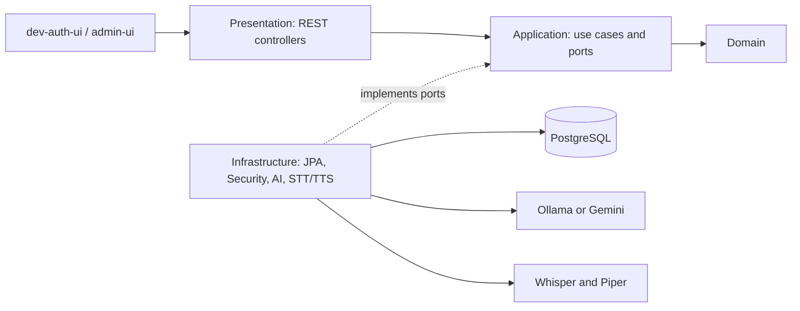

# EnglishAI

EnglishAI é uma aplicação em desenvolvimento para aprendizado e prática de inglês com recursos baseados em IA. O projeto reúne prática por conversação, leitura, vocabulário, tradução, correção, acompanhamento de progresso e recursos de voz, preservando o Backend como fonte de verdade para dados persistentes.

## Status do projeto

O projeto está na **FASE 8 — Validação pré-mobile**.

### Implementado

- Backend Java/Spring Boot com API REST versionada.
- Autenticação, perfis, catálogo de avatares e administração.
- Recursos de prática por texto, voz e IA.
- Frontend web de desenvolvimento em HTML, CSS e JavaScript vanilla.

### Planejado

- Cliente mobile em React Native.
- Memória de longo prazo, evolução de performance, observabilidade, CI/CD e deploy.

React Native não faz parte da implementação atual, e não há deploy público configurado.

## Funcionalidades

- **Autenticação e conta:** cadastro, login local, login Google opcional, verificação e reenvio de código de e-mail, refresh token, logout e endpoints de recuperação/redefinição de senha.
- **Perfil:** onboarding, nível de inglês, objetivo de aprendizagem, data de nascimento, temas claro/escuro/sistema e seleção de avatares predefinidos.
- **Conversação:** cenários dinâmicos, conversas persistentes por texto, streaming SSE, histórico, avaliação e encerramento controlado pelo Backend após participação válida suficiente.
- **Voz:** transcrição de áudio (STT) e síntese WAV (TTS) quando Whisper e Piper estão configurados.
- **Leitura:** geração de textos por dificuldade/tema, perguntas, avaliação e persistência da atividade.
- **Vocabulário:** lição diária, quiz, prática escrita, revisão espaçada e persistência do progresso.
- **Tradução e correção:** tradução português ↔ inglês com enriquecimento para textos curtos e correção de inglês com explicações.
- **Progresso:** métricas, gráficos e timeline calculados a partir dos dados persistidos.
- **Administração:** API administrativa para catálogos e cenários; rotas administrativas exigem papel `ADMIN` ou superior.

Funcionalidades de IA, Google, e-mail SMTP e voz dependem da configuração externa correspondente.

## Arquitetura

O Backend é um **modular monolith** organizado segundo princípios de **Clean Architecture / Hexagonal / Ports and Adapters**.

- `domain`: entidades e regras centrais do negócio.
- `application`: casos de uso, políticas e portas, como `LlmProvider`.
- `infrastructure`: adaptadores de persistência, segurança, provedores de IA, STT e TTS.
- `presentation`: controllers REST e DTOs de entrada/saída.

Os casos de uso dependem de abstrações; os adaptadores concretos implementam essas portas. Assim, a aplicação não fica acoplada diretamente a Ollama, Gemini, PostgreSQL, Whisper ou Piper.



## Stack

| Área | Tecnologias |
|---|---|
| Backend | Java 21, Spring Boot 4.1.1, Maven Wrapper (Maven 3.9.16) |
| Persistência | Spring Data JPA, PostgreSQL 18.6, Flyway |
| Segurança | Spring Security, JWT, Nimbus JOSE JWT, Bucket4j, Caffeine |
| IA | `LlmProvider`, Ollama e Gemini |
| STT | Python, FastAPI, faster-whisper `>=1.1,<2` |
| TTS | Python, FastAPI, Piper TTS `>=1.2,<2` |
| Frontend | HTML, CSS e JavaScript vanilla |
| Infraestrutura local | Docker Compose |
| Testes | Spring Boot Test/JUnit, `node:test`, pytest |

## IA

`LlmProvider` é a porta usada pelos casos de uso que dependem de modelo de linguagem. As implementações atuais são:

- **Ollama**, usado localmente quando `LLM_PROVIDER=ollama`.
- **Gemini**, usado quando `LLM_PROVIDER=gemini` e suas credenciais/modelo são configurados.

Essa separação permite escolher o provider configurado sem acoplar os casos de uso ao fornecedor. Não há provider OpenAI implementado.

O caso de uso `TranslateText` trata a tradução e solicita resposta estruturada para textos curtos, permitindo incluir explicações de uso e exemplos quando o provider retorna conteúdo válido.

## Voz

### Whisper — Speech-to-Text

O diretório `whisper-service/` contém um serviço FastAPI baseado em `faster-whisper`. Ele expõe `POST /transcribe` em `http://127.0.0.1:8001` por padrão. O Backend usa `WhisperSpeechToTextProvider` para enviar áudio como `multipart/form-data`.

### Piper — Text-to-Speech

O diretório `piper-service/` contém um serviço FastAPI para síntese de WAV. Ele expõe `POST /synthesize` em `http://127.0.0.1:8002` por padrão. O Backend usa `PiperTextToSpeechProvider` por HTTP.

Whisper e Piper são opcionais para fluxos exclusivamente textuais. Áudio original e WAV não são persistidos.

## Estrutura do repositório

```text
EnglishAI/
├── Backend/                 # Spring Boot, Flyway, Compose e configuração
├── dev-auth-ui/             # SPA web de desenvolvimento
├── admin-ui/                # Interface administrativa básica
├── piper-service/           # Serviço Python de TTS
├── whisper-service/         # Serviço Python de STT
├── scripts/
├── ARCHITECTURE.md
├── DEVELOPMENT.md
├── API_V1_CONTRACT.md
├── ROADMAP.md
└── ADMIN_GUIDE.md
```

## Como executar localmente

### Pré-requisitos

- Java 21.
- Docker Desktop ou Docker Engine com Docker Compose.
- Python para servir a interface web e para os serviços de voz opcionais.
- Ollama em execução, se o provider selecionado for Ollama; o repositório não instala nem baixa modelos Ollama automaticamente.
- Node.js para executar os testes de frontend/admin.

### 1. Clonar e configurar o Backend

```powershell
git clone <URL-DO-REPOSITORIO>
cd EnglishAI
Copy-Item Backend/.env.example Backend/.env
```

Preencha `Backend/.env` com os segredos gerados, a senha do banco e a configuração do provider de IA escolhido. Nunca versione esse arquivo.

No Unix-like:

```bash
git clone <URL-DO-REPOSITORIO>
cd EnglishAI
cp Backend/.env.example Backend/.env
```

### 2. Subir PostgreSQL

```powershell
docker compose --env-file Backend/.env -f Backend/compose.yaml up -d
```

O Compose cria ou reutiliza o volume nomeado `englishai_postgres_data`. Para parar o container sem apagar dados:

```powershell
docker compose --env-file Backend/.env -f Backend/compose.yaml stop
```

### 3. Iniciar o Backend

Windows:

```powershell
cd Backend
.\mvnw.cmd spring-boot:run
```

Unix-like:

```bash
cd Backend
./mvnw spring-boot:run
```

O Backend inicia na porta `8080` por padrão.

### 4. Iniciar o frontend web

Em outro terminal:

```powershell
cd dev-auth-ui
python -m http.server 5500
```

Abra `http://localhost:5500`.

Para desenvolvimento na rede local, sirva a interface com `python -m http.server 5500 --bind 0.0.0.0` e acrescente a origem exata, como `http://<IP-DO-PC>:5500`, à variável `APP_CORS_ALLOWED_ORIGINS` em `Backend/.env`. Reinicie o Backend após a alteração.

### 5. Configurar voz opcionalmente

Whisper:

```powershell
cd whisper-service
Copy-Item .env.example .env
python -m venv .venv
.venv\Scripts\Activate.ps1
pip install -r requirements.txt
uvicorn main:app --host 127.0.0.1 --port 8001
```

Piper requer o executável e os modelos de voz configurados em seu `.env`:

```powershell
cd piper-service
Copy-Item .env.example .env
python -m venv .venv
.venv\Scripts\Activate.ps1
pip install -r requirements.txt
uvicorn main:app --host 127.0.0.1 --port 8002
```

### 6. Selecionar provider de IA

- Para **Ollama**, mantenha o serviço externo acessível e configure `LLM_PROVIDER=ollama`, `OLLAMA_BASE_URL` e `OLLAMA_MODEL`.
- Para **Gemini**, configure `LLM_PROVIDER=gemini`, `GEMINI_API_KEY` e `GEMINI_MODEL`.

## PostgreSQL e migrations

O ambiente local utiliza PostgreSQL **18.6** via Docker Compose:

- Host: `5434` por padrão (`DB_PORT`).
- Container: `5432`.
- Volume persistente: `englishai_postgres_data`.
- Healthcheck: `pg_isready` usando o usuário e banco configurados.
- Flyway aplica migrations `V1` até `V31` em banco vazio.
- Hibernate usa `ddl-auto=validate`.

O banco é persistente: não use comandos que removam volumes para a rotina normal de desenvolvimento.

## Configuração

Os templates versionados são:

- [`Backend/.env.example`](Backend/.env.example)
- [`whisper-service/.env.example`](whisper-service/.env.example)
- [`piper-service/.env.example`](piper-service/.env.example)

Principais grupos de variáveis:

| Grupo | Variáveis principais |
|---|---|
| Banco e servidor | `SERVER_PORT`, `DB_HOST`, `DB_PORT`, `POSTGRES_DB`, `POSTGRES_USER`, `POSTGRES_PASSWORD` |
| Segurança | `JWT_SECRET`, `JWT_EXPIRATION_SECONDS`, `SECURITY_REFRESH_TOKEN_HASH_SECRET`, `SECURITY_RATE_LIMIT_KEY_SECRET`, `SECURITY_EMAIL_VERIFICATION_CODE_HASH_SECRET`, `SECURITY_PASSWORD_RESET_CODE_HASH_SECRET`, `JWT_DIAGNOSTICS_ENABLED` |
| CORS | `APP_CORS_ALLOWED_ORIGINS` |
| E-mail | `MAIL_PROVIDER`, `MAIL_HOST`, `MAIL_PORT`, `MAIL_USERNAME`, `MAIL_PASSWORD`, `MAIL_FROM` |
| Google | `GOOGLE_CLIENT_ID` e variáveis `SECURITY_GOOGLE_*` |
| IA | `LLM_PROVIDER`, `OLLAMA_BASE_URL`, `OLLAMA_MODEL`, `GEMINI_API_KEY`, `GEMINI_MODEL` |
| Whisper | `STT_PROVIDER`, `WHISPER_BASE_URL`, `STT_CONNECT_TIMEOUT_SECONDS`, `STT_RESPONSE_TIMEOUT_SECONDS`, `STT_MAX_FILE_SIZE_MB` |
| Piper | `TTS_PROVIDER`, `PIPER_BASE_URL`, `TTS_CONNECT_TIMEOUT_SECONDS`, `TTS_RESPONSE_TIMEOUT_SECONDS`, `TTS_MAX_TEXT_LENGTH` |

O template do Backend também contém ajustes de rate limiting, verificação de e-mail, recuperação de senha e bootstrap administrativo. Use os templates como referência completa e mantenha segredos somente fora do Git.

## Frontend atual

`dev-auth-ui` é uma SPA de desenvolvimento em HTML, CSS e JavaScript vanilla, sem bundler.

A URL da API é resolvida nesta ordem:

1. `window.ENGLISHAI_BACKEND_URL`, quando definido.
2. Protocolo + hostname atual + porta `8080`.

Assim, `http://localhost:5500` usa `http://localhost:8080`, enquanto `http://<IP-DO-PC>:5500` usa `http://<IP-DO-PC>:8080`.

O frontend React Native é uma evolução planejada e ainda não está implementado.

## Testes

Backend no Windows:

```powershell
cd Backend
.\mvnw.cmd test
```

Backend no Unix-like:

```bash
cd Backend
./mvnw test
```

Frontend:

```bash
node --check dev-auth-ui/app.js
node --test dev-auth-ui/navigation.test.cjs
```

Admin UI:

```bash
node --test admin-ui/scenarios.test.cjs
```

Piper:

```bash
cd piper-service
pytest -q
```

Whisper:

```bash
cd whisper-service
pytest -v
```

## Segurança

- Spring Security stateless.
- Access token JWT por bearer token.
- Refresh token com hash, rotação, revogação e logout.
- Verificação de e-mail e recuperação de senha.
- Rate limiting para operações de autenticação.
- CORS com allowlist explícita, sem wildcard global e sem credenciais cross-origin.
- Segredos configurados por variáveis de ambiente e arquivos `.env` locais ignorados pelo Git.
- Diagnósticos JWT desabilitados por padrão.

## Documentação

- [Arquitetura](ARCHITECTURE.md)
- [Desenvolvimento local](DEVELOPMENT.md)
- [Contrato da API v1](API_V1_CONTRACT.md)
- [Roadmap](ROADMAP.md)
- [Guia administrativo](ADMIN_GUIDE.md)

## Screenshots

Screenshots reais e sanitizadas da aplicação serão adicionadas futuramente.

## Licença e uso

Este projeto é publicado para fins de portfólio e demonstração. No momento, não há uma licença open source concedida; a ausência de licença deve ser respeitada.
